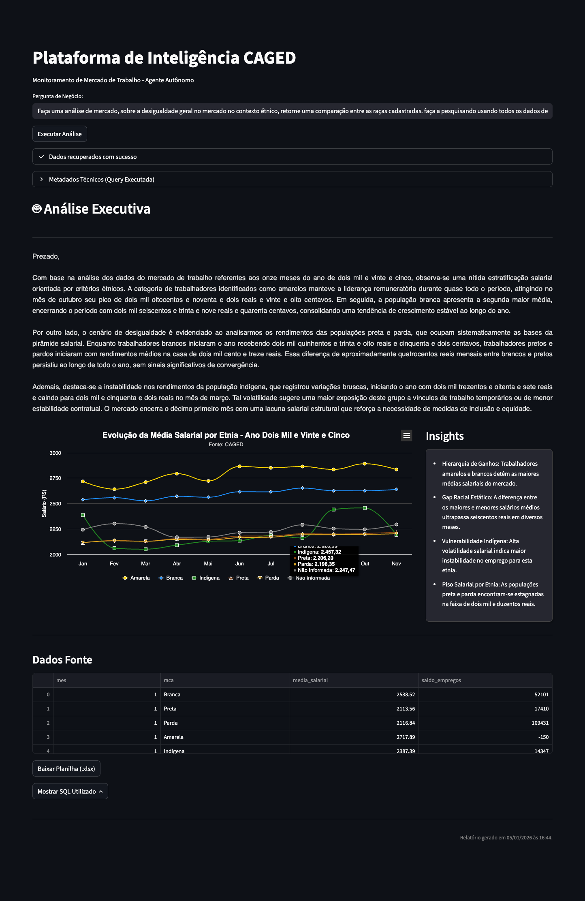
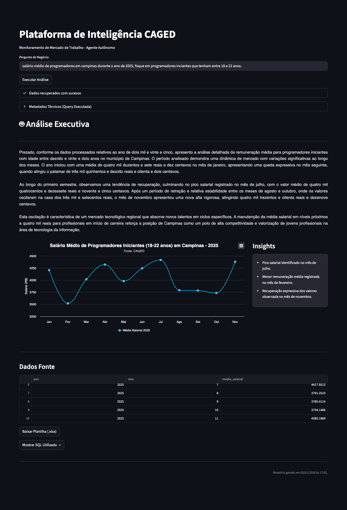

# CAGED AI Analyst: Plataforma de Inteligência de Mercado

Transformando milhões de registros governamentais em insights estratégicos através de Agentes de IA e Big Data.

---

## A Visão do Projeto

O **CAGED AI Analyst** é uma solução de *Generative BI* que democratiza o acesso aos microdados do Cadastro Geral de Empregados e Desempregados (CAGED).

Ao invés de depender de dashboards estáticos ou analistas de SQL para cada nova pergunta, o usuário interage em linguagem natural. O sistema utiliza **Large Language Models (LLMs)** para atuar como um engenheiro de dados (gerando SQL) e como um analista de mercado (gerando insights e gráficos dinâmicos).

---

## Diferenciais Competitivos

* **Agente SQL Autônomo:** Traduz perguntas complexas (ex: "Qual o salário médio de Devs em Campinas?") em consultas SQL otimizadas para Databricks.
* **Contexto Injetado:** A IA possui um "dicionário mental" com códigos **CBO** (Ocupações), **IBGE** (Municípios) e **CNAE**, garantindo precisão nos filtros.
* **Visualização Dinâmica (Highcharts):** A IA não apenas extrai os dados, ela decide qual é o melhor gráfico (Linha, Barra, Pizza) e configura as cores e séries (ex: comparativo Homem vs Mulher) automaticamente.
* **Arquitetura Lakehouse:** Processamento massivo de dados usando Delta Lake no Databricks.

---

## Arquitetura da Solução

O projeto é dividido em dois grandes pilares: Engenharia de Dados (Backend) e Aplicação de Usuário (Frontend/AI).

### 1. Engenharia de Dados (ETL & Lakehouse)
**Arquivo de referência:** `silver.ipynb`

O pipeline de dados foi construído dentro do Databricks conectando-se ao Azure Blob Storage.

1.  **Ingestão (Bronze):** Leitura de arquivos brutos compactados (`.7z`) direto do Data Lake.
2.  **Processamento (Silver):**
    * Descompactação e leitura com PySpark.
    * Tratamento de tipagem (Cast de colunas).
    * Cálculo de colunas derivadas (`salario_mensal_final` baseado em horas contratuais).
    * Limpeza de outliers e dados inconsistentes.
3.  **Armazenamento:** Gravação em formato **Delta Table** particionado por Ano e Mês para alta performance de leitura.

### 2. A Aplicação (AI Agent)
**Arquivo de referência:** `app.py`

A interface em Streamlit orquestra o fluxo de inteligência:

1.  **Input:** Usuário faz a pergunta.
2.  **Text-to-SQL:** O modelo `gemini-2.5-flash` recebe o Schema da tabela Silver e o Contexto Auxiliar (Dicionário) para gerar a query.
3.  **Execução:** A query é enviada via conector SQL para o Databricks Warehouse.
4.  **Análise & Renderização:** O resultado volta para o Gemini, que retorna um JSON estruturado contendo:
    * A análise textual executiva ("Prezado,...").
    * A configuração do gráfico Highcharts (Séries, Cores, Eixos).
    * Os destaques para o resumo lateral.

---

## Tecnologias Utilizadas

* **Frontend:** Streamlit, HTML/CSS (Custom Components).
* **Visualização:** Highcharts (Renderizado via injeção de JS).
* **LLM / AI:** Google Gemini (via `google-genai` SDK).
* **Processamento de Dados:** Databricks, PySpark, Delta Lake.
* **Infraestrutura:** Azure Blob Storage (WASBS).
* **Linguagem:** Python.

---

## Como Executar o Projeto

### Pré-requisitos
* Conta no Databricks com um SQL Warehouse ativo.
* Chave de API do Google Gemini.
* Python 3.9+.

### Instalação

1.  Clone o repositório:
    ```bash
    git clone [https://github.com/seu-usuario/caged-ai-analyst.git](https://github.com/seu-usuario/caged-ai-analyst.git)
    cd caged-ai-analyst
    ```

2.  Instale as dependências:
    ```bash
    pip install -r requirements.txt
    ```

3.  Configuração de Segredos:
    Crie um arquivo `.streamlit/secrets.toml` na raiz do projeto e preencha com suas credenciais:

    ```toml
    DATABRICKS_HOST = "sua-url-databricks.azuredatabricks.net"
    DATABRICKS_HTTP_PATH = "/sql/1.0/warehouses/seu-warehouse-id"
    DATABRICKS_TOKEN = "seu-personal-access-token"
    GEMINI_API_KEY = "sua-chave-api-google"
    ```

4.  Rodar a aplicação:
    ```bash
    streamlit run app.py
    ```

---

## Exemplo de Uso

**Pergunta do Usuário:**
> "Qual a evolução salarial de Programadores em Campinas em 2025 comparando homens e mulheres?"

**Fluxo do Agente:**

1.  **Identificação:** Reconhece "Programadores" (CBO 2124%), "Campinas" (350950) e o ano 2025.
2.  **SQL Gerado:** `SELECT mes, id_sexo, AVG(salario) ... GROUP BY mes, id_sexo`.
3.  **Visualização:** O Agente detecta uma comparação e gera um gráfico de linhas (spline) com duas séries distintas (Masculino/Feminino).
4.  **Output:** Exibe um relatório com texto formal justificando as tendências e um gráfico interativo.

---

### Resultados Visuais

Abaixo estão exemplos da interface da aplicação após o processamento da pergunta acima.

**Exemplo 1: Exemplo focado na análise crítica**


**Exemplo 2: Exemplo focado no mercado**


---

## Estrutura de Arquivos

```text
/
├── app.py                # Aplicação Principal (Streamlit + Agentes AI)
├── silver.ipynb          # Notebook Databricks (ETL Bronze -> Silver)
├── requirements.txt      # Dependências do projeto
├── .streamlit/
│   └── secrets.toml      # Credenciais (Não versionado)
└── README.md             # Documentação
```

---

## Autores

Desenvolvido por Murilo e Rafael. Focado em Engenharia de Dados, Analytics e Soluções de IA.

---


Este projeto utiliza dados públicos do Novo CAGED (Ministério do Trabalho e Emprego).
